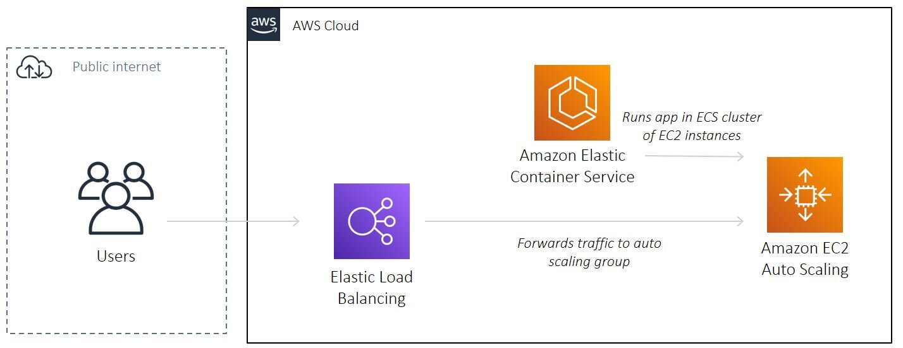

# AWS ECS Cluster EC2 Instances

A reference project to deploy an AWS ECS Cluster of EC2 Instances with Terraform

An [Apache HTTP server](https://hub.docker.com/_/httpd) running inside a container :whale:



## Pre-requisite

- Make sure you have installed [Terraform](https://learn.hashicorp.com/tutorials/terraform/install-cli), [AWS CLI](https://docs.aws.amazon.com/cli/latest/userguide/install-cliv2-mac.html#cliv2-mac-prereq), and configured a `default` AWS CLI profile (see doc [here](https://docs.aws.amazon.com/cli/latest/userguide/cli-configure-quickstart.html#cli-configure-quickstart-profiles))

```bash
terraform -help # prints Terraform options
which aws # prints /usr/local/bin/aws
aws --version # prints aws-cli/2.0.36 Python/3.7.4 Darwin/18.7.0 botocore/2.0.0
aws configure # configure your AWS CLI profile
```

## Configuration

- Create an [S3 bucket](https://www.terraform.io/docs/language/settings/backends/s3.html) to store Terraform state. Populate bucket name in `01-main.tf`

* Populate `terraform.tfvars`:

```bash
default_region            = "us-east-1"
app_name                  = "aws-ecs-ec2-app"
environment               = "staging"
```

## Deploy

```bash
cd deploy # change to deploy directory
terraform init # initialises Terraform
terraform apply # deploys AWS stack. See output for AWS loadbalancer DNS name
terraform destroy # destroys AWS stack
```

## Contributing

Pull requests are welcome. For major changes, please open an issue first to discuss what you would like to change.

Please make sure to update tests as appropriate.

If you find this project helpful, please give a :star: or even better buy me a coffee :coffee: :point_down: because I'm a caffeine addict :sweat_smile:

<a href="https://www.buymeacoffee.com/matlau" target="_blank"></a>

## License

[MIT](https://choosealicense.com/licenses/mit/)
